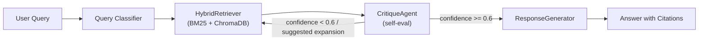

# DocWhisperer 🔍
> Tagline here

## What is DocWhisperer?
DocWhisperer is an agentic Retrieval-Augmented Generation (RAG) system designed to answer questions over technical documentation with provenance-aware answers. It combines intent classification, hybrid retrieval (BM25 + ChromaDB semantic search), self-critique, and generation to produce concise, citation-backed responses suitable for documentation teams and developer workflows.

## Architecture


## Features
- Intent-aware retrieval: classifies queries to pick appropriate retrieval strategies.
- Hybrid retrieval: combines BM25 lexical search with ChromaDB semantic vectors, merged via Reciprocal Rank Fusion (RRF).
- Self-critique loop: a CritiqueAgent evaluates retrieval quality and triggers query expansion + retry when necessary.
- Provenance-preserving generation: answers include inline [DocID] citations and avoid hallucinations.
- Document ingestion: chunking, embedding, ChromaDB persistence, and BM25 index building.
- Built-in RAGAS evaluation utilities for faithfulness and context metrics.

## Tech Stack
- Python
- FastAPI (backend)
- Streamlit (frontend)
- LangChain / LangGraph for LLM orchestration
- ChromaDB for vector storage
- BM25 (rank_bm25) for lexical retrieval
- RAGAS for evaluation

Badges

- Python: https://img.shields.io/badge/python-3.11-blue
- FastAPI: https://img.shields.io/badge/FastAPI-%3E%3D0.101.1-brightgreen
- LangChain: https://img.shields.io/badge/LangChain-%3E%3D0.0.300-yellowgreen
- ChromaDB: https://img.shields.io/badge/ChromaDB-%3E%3D0.3.29-orange

## Quick Start
### Prerequisites
- Python 3.10+ (3.11 recommended)
- pip
- Optional: OPENAI_API_KEY for OpenAI LLMs and embeddings (used by ingestion, pipeline, and evaluation)

### Installation
1. Create a venv and install dependencies:

```bash
python -m venv .venv
source .venv/bin/activate
pip install -r requirements.txt
```

### Configuration (.env setup)
Create a .env file or export environment variables expected by backend.config.Settings (see config usage). Common variables:
- OPENAI_API_KEY: (optional) OpenAI API key for LLMs and embeddings
- OLLAMA_URL: (optional) Ollama base URL when using local models fallback
- CHROMA_DB_DIR: path where ChromaDB will persist (default: ./chroma)
- RAGAS_EVAL_OUTPUT: path to save evaluation JSON

Example .env:

```env
OPENAI_API_KEY=sk-...
CHROMA_DB_DIR=./chroma
RAGAS_EVAL_OUTPUT=./eval/results.json
```

### Running the Backend
Start the FastAPI app with Uvicorn:

```bash
uvicorn backend.main:app --reload --host 0.0.0.0 --port 8000
```

Endpoints:
- GET /health — health check
- POST /ingest — ingest documents from a directory (body: {"path": "/path/to/docs"})
- POST /query — query the RAG pipeline (body: {"query": "..."})
- GET /eval — run a quick RAGAS evaluation on recent queries

### Running the Frontend
From the project root, run:

```bash
streamlit run frontend/app.py
```

The Streamlit UI connects to the API endpoint (default http://127.0.0.1:8000) and provides chat, ingestion, and evaluation controls.

## Usage
1. Ingest your documentation corpus:
   - Use the Streamlit UI or POST /ingest with a path to a directory containing .pdf, .md, or .txt files.
2. Query the system via the Streamlit chat or POST /query. The pipeline returns a concise answer with cited DocIDs.
3. If results seem insufficient, the CritiqueAgent may automatically retry retrieval with an expanded query.
4. Use GET /eval to run RAGAS evaluation on recent queries (requires OPENAI_API_KEY).

## Evaluation (RAGAS)
DocWhisperer integrates RAGAS to measure:
- Faithfulness: whether answers are supported by context
- Answer Relevancy
- Context Precision & Context Recall (when ground-truth is provided)

Use the /eval endpoint or the Streamlit button to run a quick eval on the most recent queries. Results are saved to RAGAS_EVAL_OUTPUT.

## Project Structure
- backend/
  - agents/ — classifier, retriever, critique, generator agents
  - ingestion/ — document ingest, chunking, embedding, BM25 index
  - pipeline/ — LangGraph wiring and orchestration
  - evaluation/ — RAGAS evaluation utilities
  - main.py — FastAPI application
- frontend/ — Streamlit app (app.py)
- requirements.txt
- README.md

## Skills Demonstrated
- Multi-stage RAG pipeline design (classification, hybrid retrieval, critique loop, generation)
- Hybrid retrieval and Reciprocity Rank Fusion implementation
- Prompt engineering with structured LLM outputs (Pydantic parsing)
- Production-style app wiring with FastAPI + Streamlit
- Evaluation using RAGAS metrics

## License
MIT License — see LICENSE file for details.
